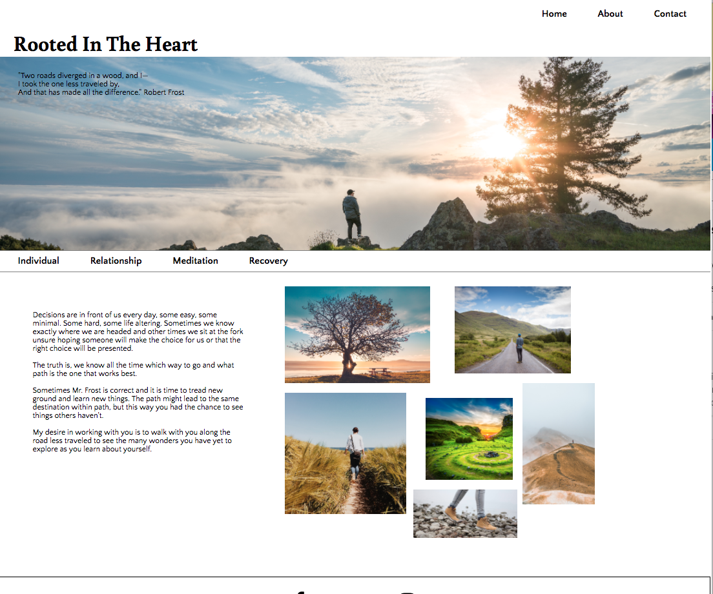
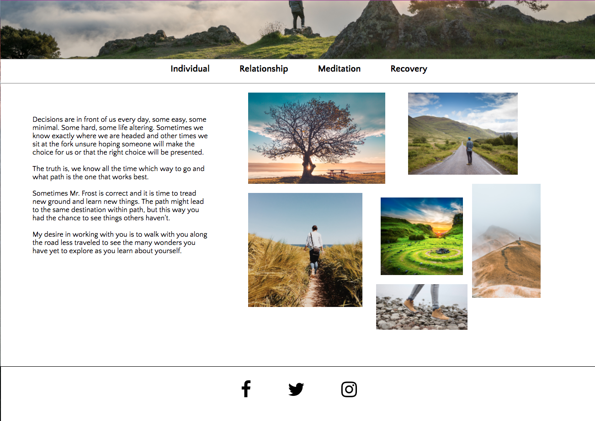
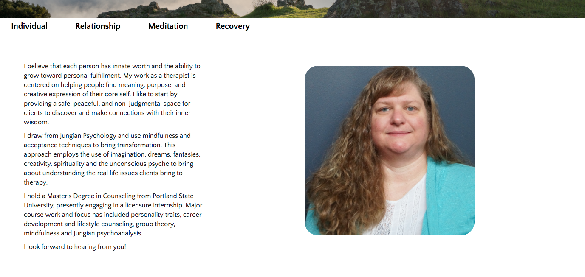
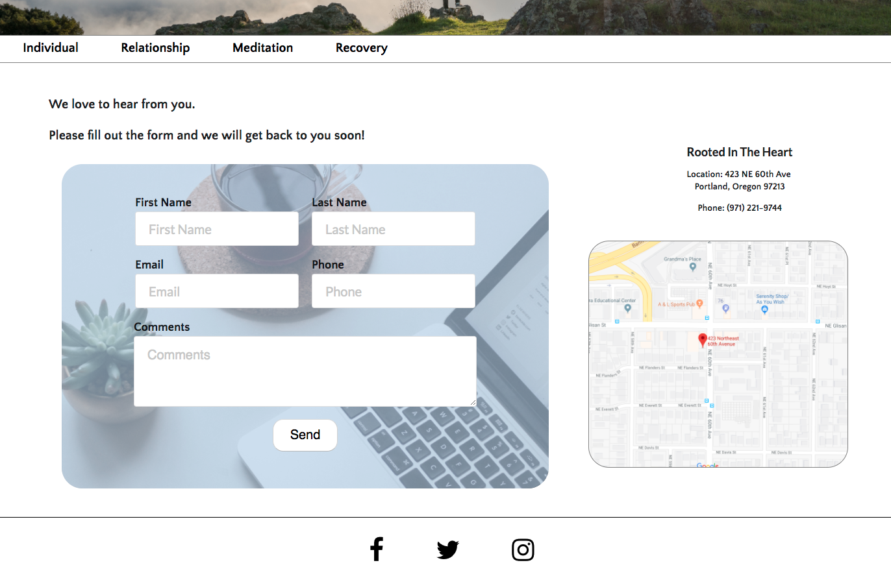

# Business Site 
Michelle Bautista

## Objective

Create a website for a client's new counseling business. For the MVP version she has requested a basic website showing the services she offers, location of her business, and a biography. Feeling on the website should be clean, clear, and people heading down pathways.

Future additions to the site will include a backend for the client to loginto to manage her new patience. 

## Links:
  Live URL: Coming soon still in mvp initial build process

  GitHubRepository: 
  
  https://github.com/mba15/portfolio-projects/tree/master/business-site

## Technologies Used:
  * HTML, CSS, JavaScript, React
  * Node.js, Express, MongoDB, Mongoose
  * Redux, Axios

## Screenshots
Home Page
 

Home Page Content
 

About Page
 

Contact Page
 

## Future Additons

MVP Objectives Left
Email forwarding of form to the client to alert her a new contact request has been entered.
Google Maps Intigration with click for directions.
Click to call from the contact page.
Styling/ Content from Client
Responsive
Services Pages 

Phase 2
As a crisis counselor she needs it to have the ability for new and current clients to reach out to her quickly in case of crisis. Chat intigration. Header Carosel. Backend ability to manage clients.

Phase 3 
SMS message sending
Carosel on header
TBD